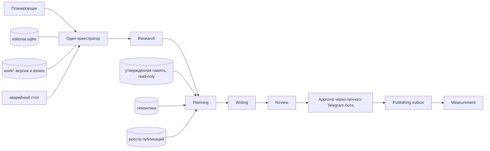

# Редакция MetricHit: активная архитектура статьи с изображениями

> Актуализация 2026-09-05. Этот раздел имеет приоритет над историческим содержимым ниже, которое сохранено только для аудита и не является действующей командой на реализацию.

## Активный scope и границы

Текущий результат — проверенный комплект для ручного размещения: один структурированный исходник статьи, детерминированная чистая copy-paste проекция, принятые изображения с позицией и alt-текстом и фактический QA-отчёт. Комплект пригоден для размещения, но не считается опубликованным.

Не входят в активную поставку: проверка индексации, позиций или эффективности ПФ; запуск ПФ; measurement конверсий; публикация без отдельного owner-gate; scheduler, monitoring, API-редакция, новые внешние интеграции или постоянные чаты. Поисковая цель ограничивает семантику, но не обещает индексацию или ТОП.

Старая схема `Research → Planning → Writing → Review → Approval → Publishing → Measurement` ниже — отложенное историческое направление, а не активный MVP.

## Единый паспорт, роли и быстрый маршрут

Один версионированный spec для article/action/revision содержит площадку, аудиторию и один интент; утверждённые запрос и H1; secondary queries и кластеры; geo-подтверждение; LSI с зонами; выбранную владельцем структуру; правила объёма/ссылок; visual package; источники, product facts, contract version, hashes и acceptance. Отсутствующий или противоречивый spec блокирует генерацию и QA; `null` не является bypass. Несогласованные числовые нормы не усредняются.

Planner+Architect одним проходом предлагают три структуры по реальному реестру и финальным версиям; первая не считается выбранной. После выбора владельца Writer остаётся единственным автором и сборщиком. Designer готовит assets в изолированном staging; Validator выполняет вычислимый QA и отдельный content/visual review. Существующие profiles остаются `isolated_sequential`; новая параллельность не включается этим документом.

QA читает фактические текст и assets: H1, объём, queries, LSI в границе раздела, четыре реальные зоны ссылок, refs, читаемость, размеры, ratio, версии и hashes. Originality — реальное source-overlap с hashes и источниками; отсутствие источника не доказывает нулевой overlap. Metadata не доказывают semantic mapping, diversity или отсутствие screenshots; это отдельный visual review.

## Подтверждённые дефекты и этапы

| Defect | Состояние и этап |
|---|---|
| A–D, L | ложный zero-overlap, фиктивный visual pass, metadata-only links/LSI и null-spec bypass; плюс двусмысленность copy-paste структуры — Этап 1 |
| E–G | README вместо реестра, autoselect структуры, geo только по кластеру — Этап 2 |
| H–K | helpers вне production path, нет durable resume, несогласованная migration и retry identity — Этап 3 |
| N | пять profiles в DB остаются sequential — Этап 4 |
| M | P0/P1 — поставленные primitives, но acceptance не закрыт — отражено в roadmap |

0. План и handoff — этот change set.
1. Обязательный достоверный QA и единый spec (A–D, L) — следующий этап.
2. Planner, применимые правила и owner approval структуры (E–G).
3. Реальная сдача, recovery и idempotency (H–K).
4. Совместимая безопасная параллельность с одним writer (N).
5. Два-три реальных проверенных комплекта с измерением производства.

Внешняя публикация, расходы, доступы и удаление остаются owner-gates; ядро 302 не меняется.

---

# Историческая архитектура автоматизации (неактивна)

Дата проектирования: 2026-08-13
Статус: рекомендация для MVP; приложение, аккаунты и интеграции не создавались

## Однозначная рекомендация

Сделать один сервис-оркестратор с конечным автоматом и строго ограниченными модулями этапов. Этапы не общаются друг с другом произвольно: каждый получает версионированный вход, возвращает JSON по схеме и фиксирует результат в отдельном редакционном контуре. ИИ не управляет очередью, правами, бюджетом или публикацией.

Первый рабочий контур:

1. код получает и очищает материалы только из allowlist;
2. Luna классифицирует очищенные фрагменты;
3. Terra предлагает план, пишет один основной материал и производные посты;
4. код и Terra проводят проверки;
5. владелец отдельно утверждает план, текст и публикацию;
6. Telegram публикуется через Bot API; VK включается только после отдельного теста прав и изображений;
7. Дзен и отраслевые площадки получают пакет для ручного размещения;
8. публикация считается завершённой только после получения и проверки URL.

Sol не входит в обычный маршрут. Его можно применить к конкретному сложному материалу только после показа стоимости и отдельного согласия владельца.

Подробности распределены без повторения:

- [модель данных](editorial-data-model.md);
- [ежедневный цикл](editorial-daily-workflow.md);
- [матрица площадок](editorial-publishing-matrix.md);
- [12-недельный план MVP](editorial-mvp-roadmap.md);
- [стоимость и безопасность](editorial-cost-and-safety.md);
- [открытые решения](editorial-open-questions.md).

## Результат read-only инвентаризации

### Подтверждено локальными материалами

| Контур | Наличие и формат | Что можно использовать |
|---|---|---|
| Утверждённая память | `data/database/metrichit.db`, 8 миграций; `memory-cli.mjs` даёт read-only выборки | Только активные утверждённые факты, решения и правила с источником и версией |
| Семантика | `work/articles/research/Semantic_map_MetricHit.xlsx`: 5 листов, 100 запросов, 10 кластеров, 7 приоритетных статей, реестр 4 публикаций | Кластеры, интенты, приоритеты и антиканнибализация; частотность Wordstat пустая |
| Стратегия | DOCX/PDF и мастер-бриф в `work/articles/research/` | Денежная цель — первое пополнение; одна поисковая цель — одна основная страница |
| Статьи | Подтверждены 3 публикации в Дзене и 1 в Sostav/SBlogs | Названия, даты, URL и основные кластеры; исходные тексты и полные списки источников сохранены не для всех |
| Telegram | 7 основных постов, навигация и новостной пост; 1 отложенный черновик | История тем и стиля; ранние категоричные тезисы нельзя повторять как факты |
| VK | Подтверждён один приветственный пост; есть обложка, карточки и чек-лист | Визуальный стиль и будущие заготовки; URL публикации и статус части assets неизвестны |
| Бренд | 6 логотипов и тарифная сетка | Тёмная палитра, cyan-акцент, официальная тарифная сетка |
| Лендинг | Статический `go.mtrhit.ru`; публикационная версия не подтверждена | Формулировки и assets как рабочие материалы, но не как доказательство текущего сайта |
| Отчёты/аналитика | Каталоги созданы, содержательных отчётов нет | Пока только место для будущих агрегатов |

Физически в `work/` 78 файлов, включая README, три архивных ZIP и миграционные записи. Миграционный отчёт выделяет 54 рабочих материала. Это разные метрики и их нельзя смешивать в отчётах.

### Подтверждённые площадки

- Telegram-канал `t.me/mtr_hit` существует; подтверждены публикации.
- VK-сообщество существует; приветственный пост подтверждён, публичный URL не сохранён.
- Дзен используется; подтверждены три статьи и URL.
- Sostav/SBlogs используется; подтверждены блог и одна статья.
- В Oborot.ru отправлен запрос на блог, но доступ к публикации не подтверждён.
- В Timeweb Cloud отправлен авторский питч, но ответ не подтверждён.
- Workspace упомянут как кандидат, решение о публикации не подтверждено.
- MAX упомянут в материалах, но официальный канал MetricHit и редакционная роль не подтверждены.
- Этап Avito объявлен завершённым и не относится к редакционному MVP.

### Данных недостаточно

- нет точной частотности, регионов, устройств и сезонности Wordstat;
- нет полного реестра источников и обложек четырёх статей;
- нет URL последних Telegram-публикаций, VK-сообщества и VK-поста;
- нет подтверждения финальной VK-обложки и публикации чек-листа;
- нет согласованной частоты и времени публикаций;
- нет юридически проверенного перечня допустимых продуктовых утверждений и маркировки рекламы;
- нет allowlist интернет-источников владельца;
- нет событий `registration_complete`, `first_topup`, `first_project_launch`, `repeat_topup` и сквозной атрибуции;
- нет токенов, аккаунтных прав и исправленных ACL — это правильно для текущего этапа.

### Граница утверждённой памяти

Существующая SQLite-память защищает утверждённые факты, решения, задачи, версии документов, конфликты и append-only аудит. Черновик, новость, найденная веб-страница, предложение модели, результат публикации и метрика не являются фактом MetricHit. Оркестратор читает память через read-only адаптер. Запись в `memory_candidates` — отдельный, выключенный по умолчанию процесс после явного решения владельца; автоматического продвижения в `memory_items` нет.

## Компоненты

### Ответственность обычного кода

- расписание, блокировка параллельных запусков, lease и возобновление;
- HTTP/RSS/API-загрузка только с allowlist, редиректы и лимиты;
- удаление активного содержимого, нормализация, хеширование и дедупликация;
- выбор релевантных частей памяти, семантики и истории;
- арифметика scoring, пороги, бюджеты и квоты;
- валидация JSON-схем, конечные автоматы и лимиты повторов;
- генерация Markdown/HTML-preview из утверждённой версии;
- проверка Telegram-команды одновременно по точным numeric `user_id`, ожидаемому `chat_id` и `chat.type=private`;
- outbox, идемпотентность, сверка ответа площадки и URL;
- аудит, резервирование и восстановление редакционных данных.

### Ответственность ИИ

- классификация и краткое извлечение утверждений из очищенного текста;
- объяснимое сопоставление находки с аудиторией, кластером и площадкой;
- предложение плана в заданных ограничениях;
- написание оригинальных версий под площадки;
- проверка текста по доказательной базе, стилю и рискам.

ИИ не получает токены площадок, не вызывает публикационные API, не меняет память и не назначает себе дополнительные шаги.

## Контракт этапов

| Этап | Вход | Выход | Код | ИИ и модель | Остановка | Повторы | Обязательный аудит | Подтверждение владельца |
|---|---|---|---|---|---|---:|---|---|
| Research | allowlist, время последнего получения, лимиты | нормализованные `research_item`, claims, источники, confidence, TTL | fetch, SSRF/DNS policy, очистка, даты, exact/near duplicate | Luna: классификация и извлечение; Terra только для неоднозначного первичного источника | запретный домен/IP/редирект, prompt injection высокого риска, нет даты для новости, превышен бюджет | 2 fetch + 1 AI | URL, final URL, resolved IP, HTTP status, автор/дата, hash, parser version, модель/токены | изменение allowlist; платный источник; обход блокировки |
| Planning | свежие находки, read-only память, семантика, публикации, лимиты площадок | ранжированный план дня, причины, вариант «не публиковать» | фильтры, формула, антидубли, доступность слотов | Terra Medium; Luna может предварительно сгруппировать | нет кандидата выше порога; конфликт фактов; неизвестна площадка | 1 | факторы score, штрафы, выбранные/отклонённые темы, версии входов | утвердить/изменить план до Writing |
| Writing | утверждённый plan item, evidence set, style profile, CTA | основной Markdown, платформенные варианты, asset brief | шаблоны, лимиты, ссылки, version/hash | Terra Medium; Sol High только отдельным разрешением | evidence устарел, нужен неизвестный продуктовый факт, бюджет 100% | 1 первичный + до 2 доработок | prompt-template hash, evidence IDs, model snapshot, usage/cost, file hash | Sol; изменение стратегии/оффера; использование кейса |
| Review | неизменяемая версия, claims/evidence, правила площадки, реестр | отчёт проверок, исправленная кандидат-версия либо block | линтер, ссылки, дубли, PII/secret scan, длина, CTA, citation coverage | Terra Medium: фактчекинг и редактура | критическое утверждение без опоры, клиентские данные, обход антифрода, каннибализация | 1 автоматическое исправление; затем владелец | каждая проверка, findings, принятые/отклонённые правки, новый hash | осознанное исключение из некритического правила |
| Approval | plan/review bundle, Markdown, HTML-preview, стоимость | append-only решение с actor, scope, hash, target, expiry | точные `user_id` + private `chat_id`, роль, callback nonce, защита от replay | ИИ не принимает решения; voice-to-text только как вспомогательная функция | user/chat не разрешён, hash изменился, approval истёк | 0; ожидание владельца | Telegram update ID, numeric user/chat ID, chat type, action, comment, version/hash, время | план, текст, доработка, отклонение, публикация — раздельно |
| Publishing | действующее разрешение на точный hash, target, schedule | platform ID, URL, подтверждённый статус или ошибка | адаптер, transactional outbox, проверка возможностей идемпотентности | ИИ не используется | emergency stop, target mismatch, нет разрешения, неизвестный исход прошлой попытки | повтор create только при доказанном `not_sent` или официальной идемпотентности; иначе 0 | request fingerprint без секрета, response ID/status, attempt, URL, actor | каждая публикация; отмена; удаление — новым отдельным решением |
| Measurement | URL/platform ID, окна измерения | snapshots метрик, сравнение с baseline, задача на проверку | API/read-only import, расчёты, quality flags | Luna для группировки комментариев только позднее; Terra для краткого вывода | источник недоступен, метрика несопоставима, есть клиентские данные | 2 | источник, период, raw-hash, формула, missing fields | изменение KPI/бюджета/стратегии; запись вывода в память |

Любая невалидная структура ИИ — ошибка этапа, а не повод «догадаться» и продолжить.

## Глобальные ограничения запуска

Один run имеет лимиты: не более 7 этапов, 3 тем в плане, 1 полного материала, 2 производных постов и 2 редакционных доработок. Для create-публикации нет общего числового retry: повтор допустим только при доказанном `not_sent` или документированной идемпотентности конкретного API. Никакой рекурсии между этапами. После лимита run переходит в `needs_owner`, сохраняя последнее корректное состояние.

Запуск останавливается до публикации, если:

- нет сильной темы (`score < 75`) — это успешный результат `no_publish`;
- свежесть или авторство ключевого источника не подтверждены;
- критический факт не имеет достаточной опоры;
- найден секрет, клиентский/персональный идентификатор или запрещённая операционная деталь;
- версия после согласования изменилась хотя бы на байт;
- исчерпан бюджет, активирован kill switch или не подтверждён target;
- результат предыдущего сетевого вызова неизвестен: `publish_uncertain`, автоматическая повторная отправка запрещена. Для Telegram владелец вручную сверяет канал и привязывает найденный message ID/URL либо создаёт новое разрешение на осознанную повторную публикацию.

## Изоляция модулей

| Модуль | Читает | Пишет | Сетевой доступ |
|---|---|---|---|
| Research fetcher | allowlist/config | research staging и редакционная БД | только HTTPS GET/HEAD на разрешённые host/path после DNS/IP-проверки каждого соединения и redirect |
| Memory reader | утверждённая SQLite-память | ничего | нет |
| Model gateway | подготовленный context bundle | usage и структурированный результат | только API модели |
| Approval bot | редакционные preview/решения | approval/audit | только Telegram Bot API |
| Telegram publisher | один approved job | publication result | только Telegram Bot API |
| VK publisher | один approved job | publication result | только VK API; выключен до теста |
| Manual packager | утверждённые файлы | ZIP/Markdown/HTML package | нет |
| Measurement | известные URL/ID | snapshots | только read-only API/страницы из allowlist |

Публикационные модули не имеют write-доступа к памяти и черновикам. Research не видит секреты. Model gateway получает только отобранный контекст без токенов и клиентских данных.

## Режим симуляции

`simulation=true` является режимом по умолчанию до приёмки. Он выполняет Research → Planning → Writing → Review → Approval и создаёт outbox-задание, но заменяет внешний publisher на локальный адаптер. Адаптер проверяет payload, лимиты, media hashes и target, затем переводит задание в каноническое состояние `would_publish` с outcome `simulation_ok`, не выполняя сетевой вызов площадке.

В Telegram согласования каждое сообщение содержит заметную строку `🧪 СИМУЛЯЦИЯ — публикации не будет`. Кнопка называется `Проверить пакет`, а не `Опубликовать`. Тест считается пройденным, если после перезапуска оркестратор продолжает тот же run, не дублирует задания и воспроизводит файлы по manifest.

## Восстановимость

Редакционная БД проектируется отдельно и должна копироваться SQLite Online Backup тем же принципом, что память. В полный backup входят `work/`, конфигурация без секретов, исходный код, миграции обеих БД и Git bundle. Restore-test будущего релиза обязан дополнительно восстановить редакционную БД, открыть её read-only, проверить миграции и связать каждую утверждённую версию с существующим файлом и SHA-256.

Ни Telegram, ни площадки, ни API-провайдер не считаются основным хранилищем. Канонические версии — файлы workspace плюс метаданные редакционной БД; Git и полный backup обеспечивают историю и аварийное восстановление.
