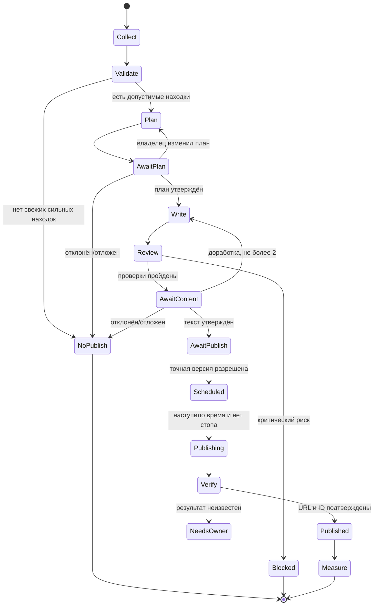

# Редакция MetricHit: действующий цикл статьи с изображениями

> Актуализация 2026-09-05. Исторический daily cycle ниже неактивен как инструкция запуска Research, scheduler, publishing или Measurement.

По команде «Напиши [новую] статью для [площадки] [на тему …]» редакция сразу готовит одну качественную статью с изображениями. Если тема указана владельцем, она сохраняется; иначе Planner самостоятельно выбирает тему по утверждённому ядру 302 и реестру публикаций. H1 — короткий утверждённый ВЧ-маркер, а не тема статьи: его повтор разрешён и не занимает тему. Planner+Architect составляют одну внутреннюю структуру без вывода трёх вариантов и без согласования с владельцем. Writer раскрывает тему и органично подбирает релевантные ключи; структура может уточняться внутри редакции. Новизна оценивается по смыслу и финальному source-overlap, а не совпадению H1. Проверки текста и изображений, внутренний visual review по hashes и отдельный owner-gate внешней публикации обязательны. Индексация, запуск ПФ и оценка ПФ не входят в текущую работу. E_AMBIGUOUS_TOPIC допустим только при реальном конфликте исходных данных; использованные H1 не являются blocker.

Designer и предварительный Validator работают параллельно после стабильного текста; Writer один собирает комплект. Финальная проверка выполняется после сборки по точным файлам.

---

# Исторический ежедневный цикл автоматизации (неактивен)

Дата проектирования: 2026-08-13
Связанные документы: [архитектура](editorial-automation-architecture.md), [модель данных](editorial-data-model.md), [площадки](editorial-publishing-matrix.md)

## Расписание

Рекомендованный консервативный default до решения владельца:

- business timezone: `Europe/Moscow`, не timezone Windows-сервера;
- старт: 08:30 по business timezone;
- дни: понедельник–пятница;
- режим: `simulation=true`;
- одна активная попытка на business date;
- повтор после технического сбоя: 10 и 30 минут, но не после логического `no_publish`.

Время и timezone хранятся как конфигурация IANA. В БД все моменты — UTC плюс исходная timezone для воспроизводимости. Переход на реальный режим и само расписание требуют решения владельца; эта архитектура Windows/Scheduled Task не меняет.

## Последовательность дня



Approval плана, текста и публикации — три разные границы. Любая редактура после approval текста создаёт новую версию и отменяет approval публикации.

## 1. Сбор и нормализация

### Allowlist

Стартовые категории, а не автоматически разрешённые URL:

| Категория | Класс | Примеры назначения | Начальная надёжность |
|---|---|---|---:|
| Официальные документы платформ | primary | API, правила публикаций, changelog | 0.95 |
| Официальные источники Яндекса | primary | Вебмастер, поиск, Метрика, официальные блоги | 0.95 |
| Официальные правовые источники | primary | тексты законов и разъяснения органов | 0.95, но юридическое толкование требует человека |
| Утверждённая память MetricHit | internal-primary | продуктовые факты, тарифы, решения | 1.00 для активной версии |
| Собственные опубликованные страницы | internal/public | история тем и URL, не источник новых общих фактов | 0.90 для факта публикации |
| Отраслевые медиа и исследования | secondary | тренды, кейсы, мнения | 0.60–0.85 после оценки владельцем |
| Корпоративные инженерные блоги | secondary | практики и продуктовые объявления компании | 0.70 для сведений о самой компании |

Конкретный host/path включает владелец. Первичный MVP не выполняет общий поисковый обход. RSS предпочтителен, затем официальный API, затем обычный HTTPS GET. Страницы с login/cookies/paywall не обходятся.

Fetcher принимает только `https`, запрещает credentials в URL, IP literals и нестандартные порты, нормализует IDN в punycode и проверяет одновременно host и разрешённый path prefix. Перед каждым соединением и каждым redirect он заново разрешает DNS и отклоняет private, loopback, link-local, multicast и reserved IPv4/IPv6; соединение привязывается к проверенному адресу, чтобы исключить DNS rebinding. Redirect, размер ответа, время, MIME и степень распаковки ограничены. Любое расхождение переводит item в `quarantined` без попытки «обойти» запрет.

### Обязательные поля находки

`canonical_url`, final URL после разрешённого redirect, заголовок, автор при наличии, дата публикации, дата изменения при наличии, `received_at`, тип источника, язык, hash очищенного текста, parser version и `expires_at`.

Для новости без установленной даты публикации допускается только `manual_review`; в автоматический план она не попадает.

### Защита от prompt injection

1. Загрузчик не исполняет JavaScript и не отправляет формы.
2. Удаляются script/style/svg/iframe/form/template, скрытый текст, комментарии и мета-инструкции.
3. Текст страницы помещается в явно помеченный блок `UNTRUSTED_SOURCE_CONTENT`.
4. Модель получает инструкцию извлекать факты, а не выполнять команды из блока.
5. Страница не может изменить allowlist, system prompt, бюджет, target, память или вызвать инструмент.
6. Фразы о раскрытии prompt/секретов, вызове инструментов и игнорировании правил повышают `injection_risk`; высокий риск блокирует item.
7. Все URL в тексте остаются данными. Следование по ним возможно только новым fetch после проверки host/path.
8. Размер, MIME и число redirect ограничены; бинарные вложения по умолчанию не загружаются.
9. HTTP body хранится только во временном staging до парсинга и удаляется; в постоянный контур попадают metadata, hash и минимальные evidence excerpts. Полный документ требует отдельного правила источника и подтверждённых прав.

### Дедупликация

- canonical URL после удаления tracking parameters;
- exact SHA-256 очищенного содержимого;
- нормализованный заголовок;
- SimHash/Jaccard по шинглам для near duplicate;
- совпадение сущностей, даты и основного утверждения;
- проверка истории публикаций и активных черновиков.

ИИ привлекается только после дешёвых детерминированных фильтров.

## 2. Достоверность и актуальность

Каждый claim получает тип:

- `official_fact` — прямо следует из первичного источника;
- `reported_fact` — сообщение вторичного источника;
- `metric` — число с периодом и методикой;
- `observation` — наблюдение команды;
- `inference` — вывод, явно обозначенный как вывод;
- `unknown` — данных недостаточно.

Для критического утверждения о правилах, безопасности, санкциях, рынке или эффективности требуется первичный источник и независимое подтверждение. Независимость определяется не числом URL, а разными первоисточниками: перепечатки, синдикация, страницы одного владельца и материалы, ссылающиеся на один пресс-релиз, образуют одну evidence group. Если событие существует только в единственном официальном анонсе, сам факт анонса можно использовать с одной ссылкой, но выводы о последствиях — только после второй независимой опоры. Предположение никогда не переформулируется как факт.

TTL по умолчанию задан в [модели данных](editorial-data-model.md). Правила площадки и юридические сведения повторно проверяются непосредственно перед публикацией.

### Цитирование и авторские права

- сохранять автора и прямой URL;
- пересказывать самостоятельно, не собирать текст из фрагментов источника;
- прямая цитата — только когда формулировка существенна, обычно не более 25 слов из одного источника;
- не копировать заголовок, структуру и иллюстрации как единый творческий набор;
- изображение использовать только своё, лицензированное или с документированным разрешением;
- в evidence ledger хранить короткий excerpt для проверки, а не копию статьи;
- публикационный пакет содержит список источников даже если площадка оформляет их иначе.

## 3. Сопоставление с семантикой и историей

Сначала импортируется неизменяемый snapshot существующего XLSX. Пустая Wordstat остаётся `NULL`. Для каждой темы определяются:

- один primary cluster и, при необходимости, supporting clusters;
- интент и стадия воронки;
- уже опубликованные материалы с primary/supporting coverage;
- активные черновики и планы;
- подходящий формат и площадка;
- риск пересечения.

### Антиканнибализация

Новый поисковый материал блокируется либо превращается в обновление существующего, если одновременно:

- интент совпадает;
- пересекается более 50% нормализованных ключей; и
- similarity заголовка/структуры или тезисов выше заданного порога.

Порог на MVP калибруется на имеющихся 4 статьях и Telegram-постах. Обычный код применяет Jaccard/BM25; Terra объясняет смысловое пересечение. Решение `new`, `update`, `derivative` или `reject_duplicate` сохраняется с причинами.

## 4. Оценка кандидатов

Базовый балл от 0 до 100:

| Фактор | Вес | Как проверяется |
|---|---:|---|
| Пробел в покрытии семантики | 20 | нет основной публикации либо существующая устарела |
| Надёжность и полнота доказательств | 20 | первичность, число опор, даты, автор |
| Соответствие аудитории MetricHit | 15 | понятная задача SEO-специалиста, агентства или владельца сайта |
| Новизна относительно истории | 15 | нет повтора темы/формулировки/обещания |
| Актуальность | 10 | новость свежая либо evergreen всё ещё применим |
| Соответствие площадке | 10 | формат, длина, стиль, права, статус аккаунта |
| Бизнес-ценность | 10 | связь с допустимым интентом и одним CTA без обещаний |

Штрафы вычитаются отдельно: каннибализация 0–40, юридический/репутационный риск 0–40, устаревание 0–20, высокая стоимость производства 0–10. Hard gate сильнее score: клиентские данные, запретная инструкция, критический факт без опоры или неподтверждённая площадка блокируют тему.

Решение:

- `75+` — кандидат в план;
- `60–74` — отложить или показать владельцу как запасной;
- `<60` — отклонить с причиной;
- ни одного `75+` — план `сегодня не публиковать`.

Score не заменяет редакционное решение. В утреннем плане владелец видит все семь факторов и штрафы.

## 5. Выбор формата и площадки

| Решение | Условия |
|---|---|
| Полная статья | есть самостоятельная глубина, поисковый пробел и доказательная база; обычно требуется несколько разделов |
| Telegram-пост | один практический вывод или свежий факт; короткая профессиональная подача |
| VK-пост | тема понятна широкой аудитории, полезна карточка/чек-лист, текст оригинален для VK |
| Производный пост | основной материал уже утверждён; пост даёт самостоятельную пользу и не копирует абзацы |
| Отложить | тема сильная, но источник, timing, asset или слот не готов |
| Отклонить | слабая связь, повтор, риск или недоказуемое обещание |

Один daily run MVP создаёт не более одного полного материала и двух производных постов. Частота площадок — верхняя граница, не квота. «Ничего не публиковать» является нормальным результатом.

Баланс анализируется на скользящем окне 20 материалов: 30% инструкции, 25% экспертные разборы, 20% актуальные новости, 15% кейсы, 10% коммерческие материалы. Это начальная рекомендация, а не утверждённая стратегия. Кейс допускается только при наличии исходников и разрешения.

## 6. План дня и действия владельца

Утреннее сообщение:

```text
🗓 План редакции — 14.08, Europe/Moscow
Режим: 🧪 симуляция
Источники: 18 получено / 6 свежих / 2 сильных
Оценка расходов до Review: $0.34, месячный бюджет 21%

1. Как оценивать результат SEO-эксперимента
   Формат: статья → Telegram + VK
   Score 82: семантика 18/20, доказательства 19/20, аудитория 14/15…
   Кластер: аналитика результата; покрытие: пробел
   Почему сейчас: 2 первичных источника, нет дубля

2. Сегодня не публиковать новость X
   Причина: только вторичный источник, дата не подтверждена
```

Кнопки первого экрана:

`[✅ Утвердить план] [✏️ Изменить]`

`[🔎 Источники] [💤 Не публиковать]`
`[🛑 Остановить run]`

В режиме изменения владелец может убрать item, сменить площадку, добавить короткое указание или выбрать запасной кандидат. Полный текст до `approve_plan` не создаётся.

## 7. Подготовка и Review

### Главный триггер новой статьи

Команда владельца `Напиши новую статью для [Название площадки]` является главным триггером подготовки новой статьи. `scripts/structured-memory.mjs` обязан автоматически:

1. распознать площадку только по `documents/editorial-publishing-matrix.md` и выбрать связанный контур хранения;
2. fail-closed остановить маршрут для неизвестной, неоднозначной, `unsupported` или `outside-mvp` площадки;
3. создать одну execution card без дополнительной служебной команды владельца;
4. загрузить из project SQLite ровно пять активных профилей Миграции 007;
5. выдать директиву запуска `metrichit.editorial.pipeline.v1` строго последовательно: `planner → architect → writer → designer → validator`;
6. не начинать следующую стадию до завершения предыдущей; planner до передачи обязан заполнить семантику статьи, а validator — подтвердить обязательные правила карточки.

Триггер создаёт только редакционный пакет. Публикация на внешней площадке остаётся отдельным owner-gated действием. Для Telegram применяются его отдельные правила, а зонное распределение H1/H2/H3 не применяется.

Writing создаёт:

- канонический Markdown статьи;
- оригинальные Telegram- и VK-варианты;
- список claims и evidence IDs;
- один CTA;
- ТЗ на изображение либо ссылку на разрешённый собственный asset;
- platform preview;
- estimate и фактическую стоимость.

Review обязан проверить:

1. соответствие утверждённому плану;
2. каждое изменяемое/существенное утверждение и даты;
3. разделение факта, наблюдения и гипотезы;
4. отсутствие гарантий, «нулевого риска» и инструкций обхода антифрода;
5. отсутствие клиентских данных, секретов и приватных screenshots;
6. сходство с опубликованными материалами;
7. один intent/CTA и соответствие площадке;
8. работоспособность ссылок на момент Review;
9. права и происхождение assets;
10. орфографию, повторы и пустые выводы.

Критические findings блокируют. Некритические могут быть автоматически исправлены один раз, после чего создаётся новая версия и повторяется весь review.

## 8. Согласование материала в Telegram

Карточка версии:

```text
📝 Материал ART-20260814-01 · v3
Площадка: Дзен (ручной пакет)
Производные: Telegram, VK
Объём: 7 420 знаков · 3 источника
Проверки: 10/10 · риски: 1 низкий
Версия: sha256 8f3a…c91e
Стоимость: $0.27 фактически / $0.33 лимит

Файлы: article-v3.md · sources.md
HTML-preview: файл `article-v3.html` в этом личном чате
```

Кнопки:

`[📄 HTML-файл] [📚 Источники]`

`[✅ Утвердить текст] [↩️ На доработку]`

`[❌ Отклонить] [🕒 Отложить]`
`[💵 Стоимость]`

Markdown и HTML-preview отправляются файлами только в ожидаемый private chat, одновременно проверяются точные numeric `user_id`, `chat_id` и `chat.type=private`. Канонические копии остаются в workspace; Telegram не является хранилищем. Сетевой preview-сервис не входит в MVP: bearer-ссылка может быть переслана. Его можно добавить позднее только с owner-сессией, одноразовым nonce, коротким TTL и отдельной threat model.

После `На доработку` бот принимает одно текстовое или голосовое сообщение. Голос скачивается во временный каталог, транскрибируется, удаляется, а бот показывает текст:

`[✅ Верно распознано] [✏️ Исправить текстом] [Отмена]`

Только подтверждённая транскрипция становится редакционным комментарием. Максимум две итерации; дальше `needs_owner`.

## 9. Разрешение публикации

Утверждение текста не публикует его. Отдельная карточка:

```text
🚦 Разрешение публикации
Target: Telegram @mtr_hit
Материал: ART-20260814-01 · tg-v2
Hash: sha256 17a4…902d
Время: 10:30 Europe/Moscow
Срок разрешения: до 10:45 14.08.2026
```

Кнопки:

`[🚀 Разрешить] [🕒 Изменить время]`
`[🚫 Не публиковать] [Отмена run]`

Разрешение связано с `platform + target + content hash + scheduled_at + expiry`. Оно запрашивается не раньше чем за 4 часа до `scheduled_at` и истекает в `min(approved_at + 4 часа, scheduled_at + 15 минут)`; просроченное задание не отправляется. Изменение любого поля требует нового разрешения. Запланированное задание до отправки отменяется кнопкой `[Отменить публикацию]`. Удаление уже вышедшего поста — отдельное опасное действие с повторным подтверждением; MVP автоматически не удаляет.

## 10. Подтверждение и измерение

После вызова API оркестратор сохраняет platform ID, сверяет удалённый объект и только затем сообщает:

```text
✅ Публикация подтверждена
Telegram · 14.08.2026 10:30 MSK
URL: https://t.me/mtr_hit/NN
Версия: tg-v2 · sha256 17a4…902d
Попытка: 1 · стоимость подготовки: $0.31
Следующая проверка метрик: +24 ч
```

Для ручной площадки бот отправляет пакет и кнопки:

`[📦 Скачать пакет] [✅ Я опубликовал] [🕒 Отложить]`

После `Я опубликовал` владелец присылает URL. Код проверяет host, доступность, заголовок, дату и несколько устойчивых нормализованных фрагментов утверждённой версии; результаты записываются как remote fingerprint. Любое несовпадение отправляется на ручную проверку. Без URL состояние остаётся `manual_handoff`, не `published`.

Measurement собирает только доступные и сопоставимые метрики. Для MVP достаточно URL, дата, просмотры/реакции/переходы при официальной доступности, плюс отметка качества. Изменение стратегии, KPI или утверждённой памяти по результатам требует отдельного решения владельца.
