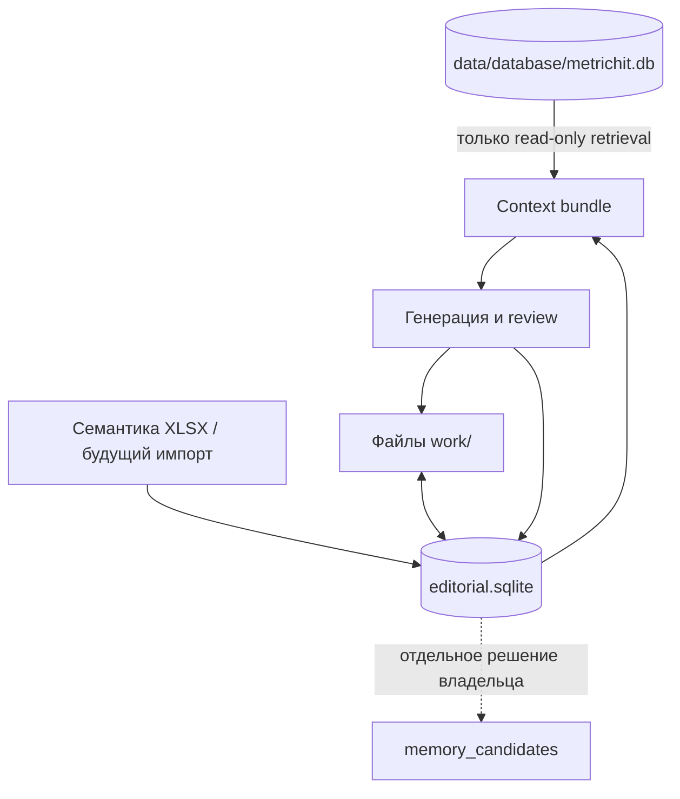

# Редакция MetricHit: действующая модель комплекта статьи

> Актуализация 2026-09-05. Историческая proposed editorial SQLite ниже не является командой создавать новую БД, сервис или таблицы.

Активный минимальный контракт — существующие context card и project records плюс один versioned article spec: article/action/parent identity, platform/audience/intent, selected owner-approved structure, semantic and geo evidence, LSI zones, text/source/image hashes, refs/anchors/alt, applicable contract pin и QA evidence. Структурированный исходник детерминированно проецируется в copy-paste текст; это не два редактируемых источника.

Публикационные IDs, URL, метрики индексации/ПФ и конверсий не требуются для подготовки комплекта. Их появление возможно только после отдельной публикации и предусмотренной штатной записи, без ручного SQL. Existing profiles остаются sequential; новая migration не выполняется docs-only этапом.

---

# Историческая модель автоматизации (неактивна)

Дата проектирования: 2026-08-13
Статус: целевая схема; миграции и SQLite в этой задаче не изменялись

## Принцип разделения

Создать отдельную физическую базу `data/editorial/editorial.sqlite`. Не добавлять редакционные таблицы в действующую `data/database/metrichit.db`. Это делает технически невозможным случайное превращение новости или черновика в утверждённый факт.



Последняя пунктирная стрелка не входит в MVP и по умолчанию выключена.

## Контуры хранения

| Контур | Каноническое хранилище | Минимальные сущности | Нельзя делать |
|---|---|---|---|
| Утверждённая память MetricHit | существующая SQLite, без новой схемы | `sources`, `memory_items`, `decisions`, `tasks`, `documents`, версии, конфликты, audit | записывать находки/черновики напрямую; давать оркестратору write-доступ |
| Редакционные правила и стили | Git-файлы с правилами; metadata/version в editorial SQLite | `style_profiles`, `rule_sets` | считать старый опубликованный текст правилом; смешивать платформенные стили |
| Семантика и кластеры | исходный XLSX остаётся доказательным артефактом; нормализованный snapshot в editorial SQLite | `semantic_snapshots`, `semantic_clusters`, `keywords`, `coverage` | придумывать Wordstat; менять импортированный XLSX |
| Реестр публикаций | editorial SQLite | `publications`, `publication_variants`, `publication_snapshots` | ставить `published` без URL или проверяемого platform ID |
| Исследовательские находки | editorial SQLite: metadata/claims/короткие excerpts; файлы только для разрешённых первичных документов | `source_definitions`, `research_items`, `claims`, `claim_evidence` | хранить полные чужие страницы по умолчанию; переносить в память автоматически |
| Контент-планы | editorial SQLite; экспорт дня в Markdown при необходимости | `plans`, `plan_items`, `scores` | генерировать полный материал до утверждения плана |
| Черновики и версии | Markdown/assets/HTML manifest в `work/`; metadata и hashes в SQLite | `content_items`, `content_versions`, `asset_links` | перезаписывать версию; хранить единственную копию в Telegram |
| Согласования | editorial SQLite, append-only события | `approval_requests`, `approval_actions` | трактовать approval плана как approval текста/публикации |
| Задания на публикацию | editorial SQLite outbox | `publication_jobs`, `publication_attempts`, `idempotency_keys` | отправлять без точного hash и target; слепо повторять неизвестный результат |
| Результаты публикаций | editorial SQLite + периодические отчёты в `work/reports/` | `publication_results`, `metric_snapshots` | выдавать отсутствующую метрику за ноль |
| Расходы ИИ | editorial SQLite | `model_runs`, `usage_ledger`, `budget_periods` | логировать API key, полный приватный prompt или скрытые рассуждения |

## Предлагаемые таблицы

Это логическая спецификация будущих миграций, не SQL текущей задачи.

### Источники и доказательства

| Таблица | Ключевые поля | Инварианты |
|---|---|---|
| `source_definitions` | `id`, `host`, `path_prefix`, `transport`, `source_class`, `reliability`, `enabled`, `reviewed_by`, `reviewed_at` | allowlist меняет только owner; host и redirect policy обязательны |
| `fetch_events` | `id`, `source_id`, `requested_url`, `final_url`, `received_at`, `status`, `content_hash`, `parser_version` | append-only; auth headers/body не сохраняются |
| `research_items` | `id`, `canonical_url`, `title`, `author`, `published_at`, `received_at`, `expires_at`, `language`, `source_class`, `reliability`, `status` | уникальность по canonical URL + content hash; `expires_at` обязательно |
| `claims` | `id`, `research_item_id`, `claim_text`, `claim_type`, `confidence`, `is_inference` | предположение всегда `is_inference=1` |
| `claim_evidence` | `claim_id`, `research_item_id`, `excerpt`, `excerpt_hash`, `relation` | excerpt короткий; одна claim может иметь несколько источников |

### Семантика и публикации

| Таблица | Ключевые поля | Инварианты |
|---|---|---|
| `semantic_snapshots` | `id`, `source_file`, `source_sha256`, `created_at`, `status` | импорт только как новая версия |
| `semantic_clusters` | `id`, `snapshot_id`, `name`, `intent`, `funnel`, `priority`, `risk` | кластер принадлежит ровно одному snapshot |
| `keywords` | `id`, `cluster_id`, `query`, `wordstat_frequency`, `region`, `device` | неизвестное остаётся `NULL`, не `0` |
| `publications` | `id`, `platform`, `platform_account_id`, `platform_object_id`, `canonical_url`, `published_at`, `status`, `verified_at` | `published_confirmed` требует URL/ID и проверки |
| `publication_variants` | `publication_id`, `content_version_id`, `primary_cluster_id`, `format`, `cta` | один primary cluster для поисковой статьи |
| `coverage` | `cluster_id`, `publication_id`, `coverage_type`, `score` | различать primary/supporting/mention |

### План, контент и согласования

| Таблица | Ключевые поля | Инварианты |
|---|---|---|
| `runs` | `id`, `business_date`, `timezone`, `mode`, `state`, `started_at`, `finished_at`, `config_hash` | один активный daily run на business date |
| `plans` | `id`, `run_id`, `version`, `status`, `estimated_cost` | версии append-only |
| `plan_items` | `id`, `plan_id`, `topic`, `platform`, `format`, `cluster_id`, `score`, `rationale`, `decision` | хранить все факторы и штрафы score |
| `content_items` | `id`, `plan_item_id`, `kind`, `canonical_title`, `state` | один основной материал может иметь производные |
| `content_versions` | `id`, `content_id`, `version`, `file_path`, `sha256`, `evidence_set_hash`, `created_by`, `created_at` | файл immutable; unique `(content_id, version)` |
| `approval_requests` | `id`, `scope`, `subject_id`, `subject_hash`, `target`, `expires_at`, `status`, `nonce_hash` | scope = plan/content/publish/budget/strategy/memory/access |
| `approval_actions` | `id`, `request_id`, `actor_user_id`, `chat_id`, `chat_type`, `action`, `comment`, `telegram_update_id`, `created_at` | append-only; unique Telegram update ID; MVP принимает только ожидаемый private chat |

### Публикация, измерение и стоимость

| Таблица | Ключевые поля | Инварианты |
|---|---|---|
| `publication_jobs` | `id`, `approval_request_id`, `content_version_id`, `content_hash`, `platform`, `target`, `scheduled_at`, `state`, `idempotency_key` | hash совпадает с approval; unique idempotency key |
| `publication_attempts` | `id`, `job_id`, `attempt`, `started_at`, `request_fingerprint`, `response_status`, `platform_object_id`, `outcome` | токен и полный payload в журнал не попадают |
| `publication_results` | `job_id`, `platform_object_id`, `url`, `published_at`, `verified_at`, `remote_hash` | immutable identity; изменения — новой записью события |
| `metric_snapshots` | `id`, `publication_id`, `window`, `captured_at`, `metrics_json`, `source`, `quality` | missing ≠ zero; raw/source hash обязателен |
| `model_runs` | `id`, `run_id`, `stage`, `model`, `reasoning`, `template_hash`, `input_tokens`, `cached_tokens`, `output_tokens`, `tool_cost`, `total_cost`, `outcome` | фактические usage из ответа провайдера |
| `audit_events` | `id`, `run_id`, `actor_type`, `actor_id`, `event_type`, `entity_type`, `entity_id`, `data_json`, `created_at`, `prev_hash`, `event_hash` | append-only hash chain; секреты запрещены |

## Файловая структура будущего MVP

Канонический текст остаётся в существующих контурах `work/`:

```text
work/
  editorial/
    plans/YYYY/MM/DD/plan-vNN.md
    research/YYYY/MM/DD/evidence-manifest.json
    previews/<content-id>/vNN.html
    manual-packages/<content-id>/<platform>/vNN/
  articles/drafts/<content-id>/vNN.md
  articles/assets/<content-id>/...
  articles/published/<content-id>/vNN.md
  social/telegram/drafts/<content-id>-vNN.md
  social/telegram/published/<content-id>-vNN.md
  social/vk/drafts/<content-id>-vNN.md
  social/vk/published/<content-id>-vNN.md
  reports/editorial/YYYY-MM.md
```

Путь — рекомендация для будущей реализации. Существующие импортированные файлы не перемещаются и не переименовываются.

Каждая версия имеет sidecar manifest: `content_id`, version, SHA-256, source/evidence IDs, primary cluster, intended platform, model run IDs, approval state. HTML-preview генерируется из Markdown и не является редактируемым источником.

## Жизненный цикл данных

| Данные | Срок | Действие после срока |
|---|---:|---|
| Новостная находка | обычно 72 часа | `expired`; повторное использование требует refetch |
| Правила площадки/API | 30 дней | повторная проверка перед публикацией |
| Закон/обязательная маркировка | 7 дней перед публикацией | повторная проверка официального источника; при сомнении manual/block |
| Evergreen-исследование | 180 дней | `stale`, пока не перепроверено |
| Метаданные источника и claim | постоянно как аудит | не превращаются в approved memory |
| Неутверждённый черновик | 90 дней по умолчанию | архивировать, не удалять автоматически в MVP |
| UI callback nonce для непубликационного действия | до решения, максимум 24 часа | инвалидировать |
| Publish approval | не более 4 часов и не позднее окна `scheduled_at + 15 минут` | `expired`; отправка запрещена |
| Сырые голосовые комментарии | только временный каталог | удалить сразу после подтверждённой транскрипции либо ошибки |
| Транскрипция комментария | вместе с approval history | хранить как внутренний редакционный комментарий |
| Audit/cost/publication identity | постоянно | append-only; исправление новым событием |

Сроки — консервативные рекомендации и вынесены владельцу на подтверждение.

## Что не сохранять

- HTTP body/HTML страницы целиком по умолчанию: тело существует только во временном каталоге до парсинга и затем удаляется. Постоянно остаются metadata, hash очищенного текста и короткие evidence excerpts. Полный первичный документ допустим только по явному правилу источника, доказанной необходимости и правам;
- cookies, session storage, auth headers, API keys и refresh tokens;
- `.env`, `.env.*`, содержимое `C:\MetricHit\secrets`;
- скрытые рассуждения модели и полный provider response;
- клиентские домены, запросы, скриншоты и персональные данные;
- необработанное аудио владельца после получения транскрипции;
- произвольные инструкции из веб-страниц;
- найденный факт как `memory_item` без отдельного owner-approved memory workflow.

## Retrieval утверждённой памяти

До вызова модели код формирует минимальный context bundle:

1. platform style + правила безопасности;
2. активные факты по semantic keys, связанным с темой;
3. не более 10 релевантных публикаций/версий;
4. один semantic cluster и соседние кластеры для проверки пересечения;
5. claims с актуальными evidence IDs.

В bundle у каждой записи есть `origin`, `status`, `valid_at/version` и access level. Черновики маркируются `editorial_unapproved` и никогда не попадают в секцию `approved_facts`.

## Согласованность и восстановление

Запись версии выполняется как операция prepare → write temp → fsync/atomic rename → SQLite transaction. При сбое незавершённая запись не становится current. Для публикации применяется transactional outbox: сначала фиксируется job, затем сетевой вызов, затем результат; перед повтором выполняется сверка площадки.

Backup будущей системы включает online-копию обеих SQLite-баз и весь `work/`. Restore-test проверяет foreign keys, `integrity_check`, миграции, hashes файлов версий, audit hash chain и наличие файлов всех approved/published записей.
