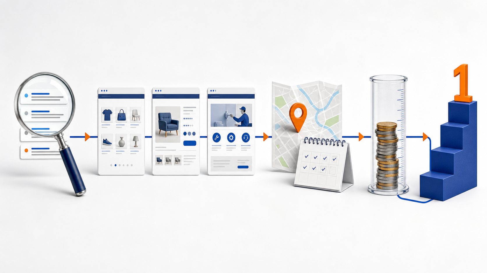

Накрутка ПФ: как бизнесу управлять поисковым продвижением и бюджетом

У владельца интернет-магазина органический спрос определяет ассортиментные приоритеты и стоимость привлечения. [Накрутка ПФ](https://go.mtrhit.ru/) помогает управлять им: бизнес выбирает группы запросов, закрепляет за ними страницы, учитывает регион и задаёт дневной лимит с бюджетом. Так поиск связывается с коммерческими задачами и понятными приоритетами.

ПФ — поведенческие факторы в выдаче. Ценность для коммерческого проекта создаёт модель: спрос разделён на смысловые группы, у каждой — приоритет и связанная страница, география соответствует работе бизнеса, а дневной лимит и бюджет относятся к направлению. Тогда продвижение обсуждают как портфель решений: что финансировать сейчас, что переносить на следующий этап и по каким данным корректировать план.

Ниже — подход для магазина с широким каталогом и сервисной компании. Руководителю достаточно зафиксировать правила выбора направлений и регулярно сверять план с фактом.

Сначала не бюджет, а карта спроса

Самая частая управленческая ошибка — начинать с доступной суммы и затем пытаться распределить её между случайными формулировками. Надёжнее двигаться в обратную сторону. Сначала бизнес определяет категории, услуги или товарные линии, которые важны в ближайший период. Затем собирает близкие по намерению запросы, сопоставляет их с отдельными страницами и отмечает регионы, где предложение реально актуально. Уже после этого появляется основание для расчёта дневного лимита.

Такой порядок нужен для сравнимости. Если в одном наборе соединить несвязанные категории, разные типы заказов и несколько территорий, динамика перестаёт отвечать на управленческий вопрос. Однородную группу можно поставить в план, оценить отдельно и сопоставить с бизнес-приоритетом.

Размер семантического ядра сам по себе не говорит о качестве работы. Крупная группа может быть хорошо организована, если внутри различимы самостоятельные сегменты. Небольшая — оказаться слишком широкой, если там смешаны разные предложения. Поэтому полезнее спрашивать не «сколько запросов собрано», а «какую коммерческую задачу описывает эта группа и на какой странице она должна сходиться».

Модель контроля для владельца

Рабочая модель состоит из пяти связанных решений. Первое — группа спроса: она должна быть достаточно узкой, чтобы выражать одну задачу покупателя. Второе — страница или категория, с которой эта задача соотносится. Третье — регион: он фиксируется там, где бизнес действительно работает и где различаются ассортимент, доставка или условия. Четвёртое — дневной объём и календарь. Пятое — правило пересмотра: заранее назначенная дата, когда руководитель смотрит на выполненный объём, расход и картину позиций по всей группе.

Эта последовательность важнее единичной позиции. Одна строка может выглядеть убедительно, но для планирования нужна динамика целого кластера. Руководитель получает возможность сравнивать не разрозненные наблюдения, а одинаково собранные периоды: направление, регион, лимит, расход, состояние группы на даты замеров. Так появляется нормальная дисциплина органического канала — без попытки объяснить каждое колебание задним числом.

Для нескольких товарных линий разумно вести отдельные направления. Тогда сезонная категория не размывает данные постоянной, а один регион не скрывает результат другого. Это также облегчает разговор между маркетингом, коммерческим блоком и владельцем: у каждого этапа есть конкретное назначение, а не общий «бюджет на SEO».

Три кейса: что видно в структуре, а не в отдельных фразах

Кейсы ниже показывают мониторинг групп запросов по датам и помогают увидеть, как по масштабу и составу семантики выстраивать управляемую структуру. Во всех трёх случаях важны кластеры, выбранные страницы, регион и очередность подключения: именно они дают понятную картину работы с группами, а не отдельные видимые формулировки.

Кейс: готовое и диетическое питание — 627 запросов

В этом массиве 627 запросов объединены общим рынком готового и диетического питания. На скриншоте видны последовательные даты замеров и позиции внутри одной большой тематической области. Для бизнеса это не повод считать все 627 строк единым объектом. Напротив, такой объём подсказывает разделить ядро на понятные подгруппы: рацион, готовые блюда, отдельные варианты заказа, региональные предложения. Каждой подгруппе назначается свой приоритет и связанная страница.

Практический вывод здесь такой: широкая семантика удобна как карта спроса, но управлять ею нужно через небольшие смысловые единицы. Сначала выбирается наиболее важная группа, затем оценивается её динамика на одинаковых датах, после чего подключается следующая. В отчёте остаётся видна общая картина по рынку, а бюджет не растворяется в десятках несопоставимых задач.

Кейс: доставка питания — 323 запроса

Второй пример меньше — 323 запроса вокруг доставки питания. Именно сравнение с предыдущим кейсом хорошо показывает, почему размер ядра нельзя превращать в единственный KPI. Здесь группа уже компактнее, но решения те же: определить, где проходит граница между самостоятельными намерениями, выбрать страницы под каждую часть и не смешивать регионы с отличающимися условиями.

Для руководителя такой кейс удобен как формат первого периода. Компактную группу проще зафиксировать в планировании: назначить ограниченный дневной объём, задать календарь и получить чистую точку сравнения. Если структура подтверждает свою полезность, она расширяется близкими сегментами. Если в наборе появляются новые типы заказов или другая география, их лучше вынести в отдельное направление, а не добавлять в общий список.

Кейс: организация мероприятий — 1 112 запросов

Третий кейс — 1 112 запросов из событийной тематики. Это самый крупный из трёх массивов, и он особенно наглядно демонстрирует портфельный подход. Внутри такого ядра неизбежно соседствуют разные бизнес-сегменты: корпоративные задачи, частные события, отдельные форматы услуг. Их не стоит оценивать одной общей цифрой, даже если они связаны общей отраслью.

Здесь разумная управленческая единица — не всё ядро, а сегмент с собственным коммерческим приоритетом. Бизнес может поставить в первую очередь одно направление, закрепить под него страницу и регион, а остальные оставить в очереди. Когда периоды сформированы одинаково, легче обсуждать расширение бюджета: не «давайте добавим ещё», а «подключаем следующий сегмент, потому что он соответствует плану сезона и не смешивается с текущей группой».

Бюджет как портфель, а не разовая сумма

После того как определены группы, страницы, регионы и очередность, расчёт становится прозрачным. В [MetricHit](https://go.mtrhit.ru/) действует предоплатная модель без абонентской платы: остаток сохраняется. Для портфеля из нескольких направлений используется общий баланс и единая ставка, поэтому деньги не нужно заранее дробить между проектами навсегда.

Тарифная шкала компактна: от 1 000 ₽ — 0,50 ₽; от 10 000 ₽ — 0,40 ₽; от 50 000 ₽ — 0,30 ₽; от 100 000 ₽ — 0,25 ₽; от 150 000 ₽ — 0,20 ₽; от 200 000 ₽ — 0,15 ₽. Для планирования достаточно умножить дневной объём на количество рабочих дней и действующую ставку. Получится плановая сумма по конкретному направлению, а не приблизительный общий бюджет.

В MetricHit полезно держать отдельные проекты для разных сайтов, регионов или самостоятельных товарных линий. Общий баланс сохраняет единый финансовый контур, а раздельные настройки не дают смешать отчётность. Владелец может начать с ограниченного числа приоритетных групп, затем перевести часть оставшегося баланса на следующий этап. Предоплата и отсутствие абонентской платы делают такой календарный подход удобным для сезонного ассортимента и теста новых направлений.

Как принимать решение о следующем этапе

Регулярный контроль не должен превращаться в ежедневное обсуждение каждой позиции. Достаточно установить ритм. На коротком интервале сверяют выполнение дневного плана и расход. На более длинном — сравнивают позиции по зафиксированной группе на датах замеров и пересматривают бизнес-приоритеты: ассортимент, сезон, регионы, план закупок. Эти уровни не стоит смешивать: первый отвечает за дисциплину исполнения, второй — за решение, куда развивать портфель.

Полезный итог периода формулируется в одном из трёх вариантов: расширить уже выбранный сегмент близкими группами; подключить следующую страницу или категорию; выделить отдельный регион в самостоятельный проект. Такая развилка помогает не терять контекст и не тратить бюджет на хаотичное увеличение списка. MetricHit в этой модели — инструмент для настройки проектов и контроля объёма, а не замена управленческого решения о приоритетах.

Итог

Накрутка ПФ для бизнеса становится понятнее, когда её связывают с управлением органическим каналом: спросом, структурой страниц, регионом, дневным лимитом и календарём пересмотра. Три кейса показывают одну закономерность: 323, 627 или 1 112 запросов — это не оценка качества сама по себе. Качество создаёт структура, в которой каждая группа имеет коммерческий смысл и место в очереди.

Начать можно с нескольких приоритетных сегментов и заранее зафиксированного бюджета на период. Затем расширять портфель только там, где сохранена ясная связь между группой, страницей, регионом и целью бизнеса. Для такой работы [MetricHit](https://go.mtrhit.ru/) позволяет вести проекты раздельно, а общий баланс — не разрывать финансовую картину между направлениями.
