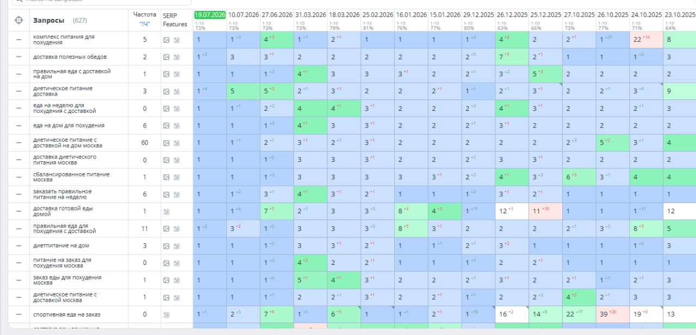
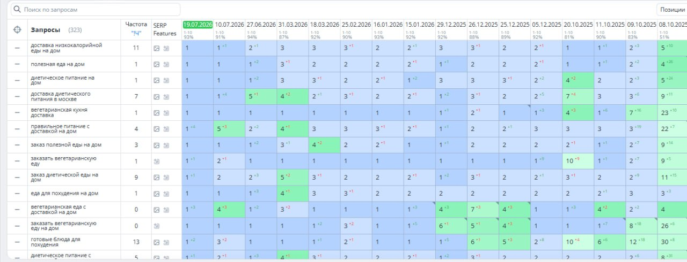
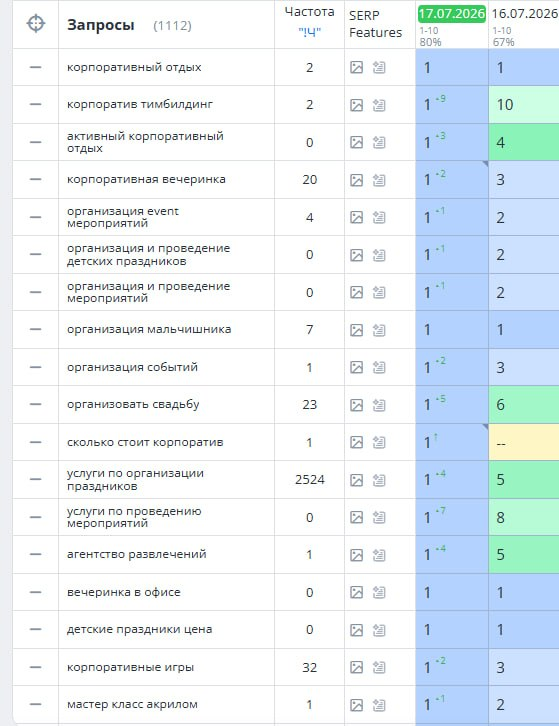

Накрутка ПФ

Накрутка ПФ интересует владельца бизнеса в момент, когда сайт уже отражает услугу, страницы готовы к работе, а заметности в поиске хочется больше. В такой ситуации важен не набор громких обещаний, а понятная система: какие направления усиливаются, на какие страницы ведёт спрос, сколько стоит объём и по каким данным руководитель принимает решение дальше.

ПФ, или поведенческие факторы, — часть сигналов, связанных с выбором результата в поисковой выдаче. Поисковая система сопоставляет запрос и страницу: человеку, который ищет услугу, нужен ясный ответ с подходящим предложением, условиями и географией. Поэтому работа с ПФ особенно логична для подготовленного коммерческого сайта: она поддерживает продвижение в поиске вместе с техническим SEO, качеством посадочных страниц и актуальным предложением.

Эта статья — практическая схема для собственника: как собрать первый проект, распределить бюджет, контролировать выполнение и постепенно расширять работу. В центре внимания — управляемое продвижение, где каждый следующий шаг можно связать с конкретной группой спроса и бизнес-приоритетом.

Что получает бизнес от работы с ПФ

Для бизнеса ПФ — способ усилить присутствие подготовленных страниц по коммерческим направлениям. Это полезно, когда компания понимает, какие услуги, категории или регионы дают ей основной результат, и хочет последовательно развивать их в органической выдаче.

Сначала фиксируется задача. Например: повысить видимость ключевой услуги в своём регионе, усилить отдельную категорию каталога или выделить сезонное предложение. Затем под неё выбирают небольшую группу близких по смыслу запросов и соответствующую страницу. Такой формат удобнее большой разнородной кампании: проще следить за расходом, видеть динамику и понимать, что именно стоит расширять.

Полезная бизнес-логика выглядит так: спрос в поиске → подходящая страница → заданный объём → наблюдение за результатом → решение о развитии. Она помогает вести SEO как управляемую работу, а не как набор разрозненных действий.

Подготовка: запросы, страницы и регион

Начните с направлений, которые действительно важны компании. У выбранной группы запросов должен быть общий коммерческий смысл: одна услуга, категория или тип заказа. Страница отвечает на этот спрос понятным предложением, актуальными условиями, контактами и способом получить услугу. Так работа с поисковой видимостью опирается на реальную ценность для будущего клиента.

Перед стартом полезно проверить четыре вещи:

- приоритет направления для выручки или стратегии;
- соответствие запроса и посадочной страницы;
- корректность региона, в котором компания реально работает;
- исходные позиции, показы и клики из поиска.

Региональность стоит рассматривать как часть предложения. Локальному бизнесу важно, чтобы география, контакты, доставка или зона обслуживания совпадали с ожиданием человека в выдаче. Для нескольких городов разумнее вести отдельные, понятные направления и сравнивать их отдельно.

В [рекомендациях Яндекс Вебмастера](https://yandex.ru/support/webmaster/ru/yandex-indexing/rank) удобно сверять базовые свойства сайта: доступность страниц, понятность содержания и пользу ресурса. Для собственника это не техническая формальность, а подготовка сильного ответа на коммерческий запрос.

MetricHit: формат работы и стоимость

[MetricHit](https://go.mtrhit.ru/) подходит бизнесу, которому нужен самостоятельный и прозрачный формат управления проектами. Для каждого проекта задаются сайт, регион, список запросов, дневной лимит и расписание. Благодаря этому разные услуги, города или сайты остаются разделёнными, а руководитель видит планируемый и выполненный объём.

В MetricHit действует предоплатная модель: абонентской платы нет, остаток на балансе сохраняется. Для нескольких проектов используется общий баланс и единая ставка — это удобно, когда компания ведёт несколько направлений в одном аккаунте.

| Пополнение | Стоимость клика |
| --- | ---: |
| 1 000 ₽ | 0,50 ₽ |
| 10 000 ₽ | 0,40 ₽ |
| 50 000 ₽ | 0,30 ₽ |
| 100 000 ₽ | 0,25 ₽ |
| 150 000 ₽ | 0,20 ₽ |
| 200 000 ₽ | 0,15 ₽ |

Тарифная сетка позволяет заранее посчитать кампанию. Возьмите дневной лимит, число рабочих дней и ставку за клик — получится плановая сумма. Затем выберите небольшой первый период, чтобы собрать исходные данные и оценить направление. Такой подход помогает распределять бюджет осмысленно: сначала важные группы, затем расширение по подтверждённой динамике.

MetricHit даёт возможность вести сайт, регион и расписание раздельно по проектам, сохраняя общий финансовый контур. Это особенно полезно для владельца нескольких сайтов или агентства, которому важно видеть структуру работ без смешения задач.

Как запустить и контролировать первый период

Первый период лучше строить вокруг одной однородной задачи. Выберите группу коммерческих запросов, назначьте релевантную посадочную страницу, проверьте регион и зафиксируйте стартовые показатели. После этого задайте дневной лимит и период наблюдения.

Во время работы сопоставляйте три слоя данных. Первый — выполнение плана: сколько кликов выполнено и какой расход получился. Второй — видимость по заранее зафиксированной группе: здесь важна общая картина, а не одна удачная строка. Третий — органические показы и клики по соответствующим страницам. Вместе эти данные дают руководителю основу для следующего решения.

В [MetricHit](https://go.mtrhit.ru/) можно отслеживать объём и расходы по проектам, поэтому план удобно сверять с фактом в рабочем ритме. В конце периода выберите дальнейшее действие: добавить близкие запросы к уже сильной странице, подключить следующую страницу или развить отдельное региональное направление. Последовательность сохраняет ясную картину и делает масштабирование предсказуемым.

Три примера работы с семантическими группами

Ниже — скриншоты позиций по крупным группам запросов. Они иллюстрируют принцип контроля: собственник смотрит на весь кластер, даты замеров и динамику, а затем связывает наблюдение с конкретной услугой и страницей. В статье эти данные служат примерами структуры отчёта, а не перечнем фраз для копирования.

**Кейс 1. Готовое и диетическое питание — 627 запросов.** На скриншоте собрана группа запросов с общим намерением заказать готовый рацион или питание с доставкой. Видны даты замеров и позиции по ряду близких формулировок. Для владельца такого проекта это основа для управления одной услугой: выбрать подходящую страницу, задать объём и сравнивать новые замеры с исходным состоянием всей группы.

**Кейс 2. Доставка питания — 323 запроса.** Здесь выделена самостоятельная группа спроса вокруг заказа питания на дом. Отчёт показывает, почему семантику удобно разделять по коммерческому смыслу: отдельная услуга получает собственную посадочную страницу, регион и понятные показатели для регулярной сверки. Так владельцу легче видеть динамику направления, а не смешивать его с другими услугами.

**Кейс 3. Организация мероприятий и корпоративов — 1 112 запросов.** Крупная группа объединяет несколько близких направлений событийного бизнеса. Скриншот позволяет оценивать масштаб и выделять самостоятельные сегменты: корпоративные мероприятия, частные события, праздники. Такая структура помогает поэтапно развивать семантику: сначала усилить приоритетный сегмент, затем подключать следующий и видеть вклад каждого направления в общую картину.

**Как развивать кампанию дальше.** Масштабирование становится понятным, когда у каждого шага есть цель. После первого периода добавляйте близкие коммерческие запросы к выбранной странице. Затем подключайте следующую услугу или категорию. Региональные направления развивайте отдельными проектами, если отличаются предложение, география или приоритет. Перед новым этапом коротко фиксируйте цель, состав группы, страницу, регион и лимит: эта запись упрощает сравнение периодов и делает обсуждение результата предметным.

Сохраняйте простой ритм контроля. Раз в неделю сверяйте выполненный объём, расход и динамику группы запросов. Раз в месяц пересматривайте приоритеты с учётом сезонности, ассортимента и планов бизнеса. Это помогает направлять бюджет туда, где он поддерживает наиболее важные задачи компании.

MetricHit удобен именно в этой последовательной модели: отдельные настройки проекта сохраняют порядок в работе, а общий баланс и единая ставка упрощают финансовое управление. Руководитель получает не набор несвязанных действий, а систему для регулярного продвижения ключевых страниц.

Итог

Накрутка ПФ становится рабочим инструментом, когда сайт подготовлен, страница соответствует спросу, регион отражает реальную работу бизнеса, а исходные данные зафиксированы. Начните с одной важной группы, понятного дневного лимита и регулярного контроля. Затем расширяйте кампанию по направлениям, которые подтверждают свою ценность для бизнеса.

Чтобы собрать первый проект, задать регион, запросы, дневной лимит и расписание, перейдите в [MetricHit](https://go.mtrhit.ru/). Предоплата списывается за выполненный объём, абонентской платы нет, остаток сохраняется, а общий баланс позволяет управлять несколькими проектами в одном месте.
