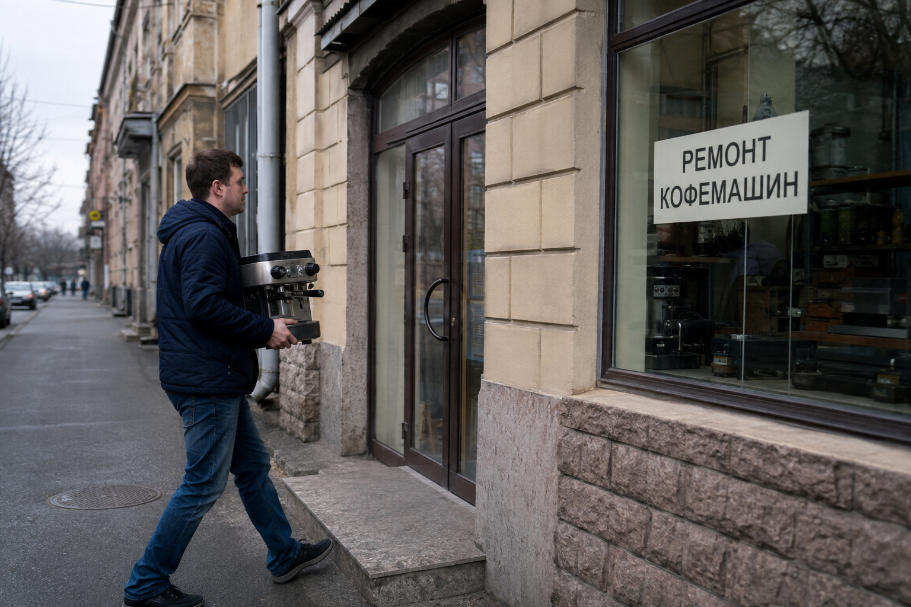

Накрутка ПФ
Накрутка ПФ — это искусственное формирование поисковых переходов с целью продвинуть сайт по нужным запросам. Бизнес обращается к этому методу, когда хочет усилить видимость в Яндексе: занять более заметные позиции по своим товарам или услугам и получить поисковый трафик.
Вокруг ПФ легко запутаться в названиях и обещаниях. За предложением «продвинуть сайт» могут стоять самостоятельная работа в сервисе, настройка кампании подрядчиком или продажа отдельной программы. Чтобы выбрать подходящий вариант, нужно понимать, какое действие вы оплачиваете, чем управляете сами и как будете оценивать результат.
Разберём, что такое накрутка поведенческих факторов, для каких задач её используют и как устроена работа через [MetricHit](https://go.mtrhit.ru/).

Что меняет накрутка ПФ
Поведенческие факторы в контексте поисковой выдачи — это сигналы, связанные с выбором результатов поиска и переходами по ним. Накрутка поведенческих факторов в Яндексе искусственно формирует такие переходы для выбранного сайта. Задача метода — повлиять на его положение по заданным запросам.
Работа привязана к поиску. У кампании есть сайт, набор фраз и регион, где его продвигают. Например, мастерской нужны позиции по запросам о ремонте кофемашин в своём городе. Популярность темы «кофе» вообще для неё мало что значит: бизнесу важны люди, которые ищут нужную услугу там, где он может её оказать.
Поэтому продвижение сайта поведенческими факторами начинается с конкретного поискового спроса. Фраза определяет, за какую аудиторию борется сайт, а регион — в какой выдаче предстоит работать. Если выбрать запросы без связи с предложением бизнеса, можно потратить бюджет на направление, которое не было ему нужно.
Накрутка ПФ сайта решает задачу поискового продвижения. Содержание страниц, ассортимент, цены и условия заказа остаются отдельной частью работы с сайтом. Например, запрос о ремонте должен вести к предложению ремонта, а не к продаже новой техники. Совпадение запроса и предложения нужно проверить до запуска — для этого не обязательно переделывать весь сайт.
В [MetricHit](https://go.mtrhit.ru/) пользователь сам задаёт сайт, регион и запросы. Так можно работать с выбранной услугой или товарной категорией, а не ограничиваться общей задачей «сделать сайт популярнее».
Клики, позиции и клиенты: что именно вы покупаете
Услуги по накрутке поведенческих факторов часто обсуждают через количество кликов. Это удобно для расчёта стоимости, но одного числа недостаточно, чтобы понять весь смысл продвижения.
Клик — единица выполненной работы. Позиция — место сайта по конкретному запросу. Поисковый трафик — переходы из поиска. Заказ или заявка — уже коммерческий результат бизнеса. Эти показатели связаны с общей целью продвижения, но подменять один другим при оценке кампании нельзя.
Когда вы оплачиваете сервис накрутки ПФ, предмет оплаты должен быть определён прямо. В MetricHit это фактически выполненные клики. Оплаченный объём сам по себе не является количеством будущих покупателей. Коммерческую задачу оценивают дальше: какие нужные бизнесу запросы стали заметнее и приходят ли обращения по выбранному направлению.
Это помогает правильно поставить задачу ещё до старта. «Нужны позиции по ремонту кофемашин в городе» — конкретная цель. «Нужно больше кликов» описывает только объём работы. Во втором случае кампания может выполнить заданный план, а владелец всё равно не поймёт, приблизился ли к нужному результату.
Продвижение сайтов поведенческими факторами оценивают по выполненной работе и её результату для бизнеса. Для первого нужны данные о кликах и расходах, для второго — позиции по целевым запросам и реальные обращения.
Для каких задач используют продвижение ПФ
Самый понятный сценарий — работа с определённым направлением бизнеса. Это может быть услуга, товарная категория или группа близких предложений, для которых уже есть подходящие страницы.
У локальной компании отправная точка — территория работы. Если мастер выезжает только по одному городу, регион продвижения должен этому соответствовать. В интернет-магазине сначала выбирают товарное направление и проверяют, что оно представлено в каталоге. Для информационной страницы исходят из вопроса, на который материал действительно отвечает.
Выбор запросов требует внимания даже внутри одной темы. «Купить кофемашину» и «ремонт кофемашин» упоминают один предмет, но приводят разную аудиторию. Запрос «как почистить кофемашину» относится уже к самостоятельному решению проблемы. Эти различия важнее простого совпадения слов в списке.
Как связать запросы с предложением
- Поисковый интент: покупка, заказ услуги, сравнение или получение инструкции.
- Релевантность страницы: соответствует ли её содержание запросу.
- Коммерческое предложение: что именно человек может заказать и на каких условиях.
- Регион продвижения: где бизнес продаёт товар или оказывает услугу.
Такой разбор позволяет выбрать осмысленный набор фраз для кампании. Частотность показывает масштаб спроса, а соответствие предложению помогает решить, нужен ли этот спрос вашему бизнесу. Высокочастотный запрос не становится полезным только потому, что его часто вводят.
Поведенческое продвижение удобно обсуждать применительно к этим задачам: усилить выбранную категорию, поработать с нужной услугой, расширить видимость по близким запросам. Для каждого направления можно заранее определить, какие позиции предстоит отслеживать и какой бюджет на него выделен.

Сервис, программа или подрядчик
Прежде чем заказать накрутку ПФ, определите, какую часть работы вы хотите передать. Автоматическое выполнение кликов и управление продвижением — разные обязанности.
Программа для накрутки ПФ требует проверки условий запуска: где она работает, какие ресурсы ей нужны, как она обновляется и кто устраняет сбои. До покупки уточните, какие расходы и технические задачи останутся на вашей стороне.
Сервис для накрутки поведенческих факторов выбирают по условиям выполнения кампании: какие параметры можно задать, за что списываются деньги и что видно в отчёте. Заранее уточните, кто решает вопросы с выполнением и как связаться с поддержкой.
Если настройку и ведение берёт подрядчик, отдельно согласуйте его обязанности. Кто собирает запросы? Кто выбирает регион и объём? Что входит в отчёт? Стоимость выполненных кликов и вознаграждение за ведение — разные статьи расходов, если подрядчик выставляет их отдельно.
MetricHit рассчитан на самостоятельную настройку проекта владельцем сайта или SEO-специалистом. Вы указываете сайт, регион, запросы, дневные лимиты и расписание. Затем контролируете выполненные клики, расходы и позиции в личном кабинете.
Что важно при выборе MetricHit
Сравнивая сервисы накрутки ПФ, начните с условий, которые будут влиять на вашу работу каждый день. В MetricHit это самостоятельные настройки, оплата за выполненные клики и возможность следить за кампанией в личном кабинете.
**Управление объёмом.** Пользователь задаёт дневные лимиты и расписание. Это позволяет заранее спланировать работу на выбранный период. Когда меняется задача продвижения, можно пересмотреть параметры проекта, а не оставлять прежний объём только потому, что он был задан однажды.
**Оплата выполненных кликов.** Деньги списываются за фактически выполненные клики. Запланированный объём и выполненная работа учитываются раздельно: для проверки расходов нужно смотреть на выполнение.
**Отсутствие фиксированной абонентской платы.** В сервисе используется предоплата, а не обязательный ежемесячный платёж за доступ. Неиспользованный остаток не сгорает. Это важно, если бюджет выделяют поэтапно и хотят понимать, какая сумма ещё доступна для дальнейшей работы.
**Контроль в личном кабинете.** Клики, расходы и позиции можно наблюдать в одном рабочем месте. При этом каждый показатель отвечает на свой вопрос: выполнен ли объём, сколько потрачено и где находится сайт по выбранным фразам.
[Посмотреть MetricHit и зарегистрироваться](https://go.mtrhit.ru/) стоит, если вам нужен сервис для накрутки ПФ с самостоятельным управлением кампанией. Проверить процесс можно на тестовых кликах: условия их получения разберём ниже.
Из чего складывается стоимость
Стоимость накрутки поведенческих факторов зависит от цены клика и количества выполненных кликов. Для MetricHit расчёт выглядит так:
**Расход = выполненные клики × применимая стоимость клика.**
Если запланировано 3 000 кликов, а выполнено 2 400, в расчёте фактического расхода участвуют 2 400. Это учебный пример учёта, а не рекомендация по объёму кампании.
Для предварительного планирования используют обратный расчёт:
**Доступное количество кликов = выделенный бюджет ÷ применимая стоимость клика.**
Полученное число показывает, какой объём можно оплатить. Оно не определяет автоматически, сколько кликов нужно конкретному запросу. Выбор объёма кампании и расчёт её стоимости — отдельные задачи.
В MetricHit цена начинается от 0,15 ₽ за клик. В собственную смету подставляйте стоимость, применимую к вашему пополнению. Если планируете работу на несколько дней, распределите выделенный бюджет по выбранному периоду и сверьте его с дневными лимитами.
Когда нужна недорогая накрутка поведенческих факторов, одной минимальной цены для сравнения мало. Имеет значение, оплачивается ли план или выполнение, есть ли обязательная абонентская плата и что происходит с неизрасходованными деньгами. Именно эти условия определяют, как вы будете распоряжаться бюджетом.

Как накрутить ПФ через MetricHit
Подготовьте адрес сайта, регион и список запросов. Затем создайте проект в MetricHit, внесите эти данные, задайте дневные лимиты и расписание.
Перед запуском сохраните исходные позиции по выбранным фразам. После него сравнивайте замеры для тех же запросов и региона. Так отчёт будет показывать изменения одной кампании, а не различия между случайными наборами данных.
Что смотреть в работающем проекте
- Выполненные клики: какой объём фактически отработан за период.
- Расходы кампании: сколько списано за выполненную работу.
- Позиции сайта: как изменилось положение по целевым запросам.
- Дневные лимиты и расписание: соответствуют ли настройки вашему плану.
- Даты изменений: когда вы меняли запросы, объём или страницы.
Сохраните исходный список и отмечайте существенные правки. Если в течение недели сменились регион, запросы и лимиты, сравнивать её с предыдущей как две одинаковые кампании уже неудобно.
Если выполнение расходится с планом, сначала проверьте настройки и период отчёта. Когда причина неясна, обратитесь в поддержку, указав проект, даты и запросы. Если вопрос касается позиций, смотрите, какие именно фразы изменились и относятся ли они к приоритетному предложению бизнеса.
Как получить 1 000 тестовых кликов
Новый пользователь MetricHit может один раз получить 1 000 тестовых кликов. Для этого нужно зарегистрироваться и обратиться в Telegram-поддержку сервиса со своим логином. Начисление происходит после обращения, пополнять баланс для получения бонуса не требуется.

На тесте можно пройти весь рабочий процесс: создать проект, внести запросы, задать параметры и посмотреть, как отражаются выполненные клики и расходы. Это помогает разобраться с сервисом до перехода к дальнейшей работе.
[Зарегистрируйтесь в MetricHit](https://go.mtrhit.ru/), подготовьте первый проект и обратитесь в поддержку за тестовыми кликами. Начните с выбранной задачи продвижения — услуги, категории или группы запросов, позиции по которым важны вашему бизнесу.
