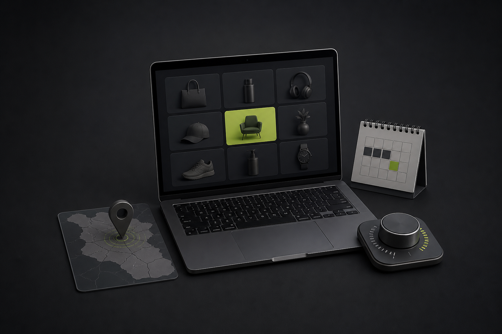

# Накрутка ПФ для интернет-магазина: как выбрать стартовую категорию

Накрутка ПФ для интернет-магазина даёт команде управляемый способ работать с видимостью категории в Яндексе — если начинать не со всего каталога, а с одной понятной коммерческой задачи. [MetricHit](https://go.mtrhit.ru/) подходит для такой настройки: в проекте фиксируются сайт, регион, запросы, дневной лимит и расписание, а затем можно сверять выполненный объём, расходы и динамику позиций.

Частая ошибка на старте — собрать в один запуск все фразы, которые нашлись в семантике. В таком наборе смешиваются разные товарные разделы, страницы и ожидания покупателей. Результат сложно оценивать: непонятно, какая именно категория была приоритетной и что менять после первого периода.

Практичнее выбрать один раздел каталога, который действительно важен для продаж сейчас. Это может быть категория со стабильным ассортиментом, понятной доставкой и отдельной посадочной страницей. Не нужен «идеальный» список на сотни фраз: стартовая группа должна отвечать на одну покупательскую задачу и вести к одному понятному разделу.

## Сначала определите границы категории

Перед настройкой полезно записать пять вещей: категорию, регион, группу запросов, целевой URL и дату первого обзора. Эти границы превращают продвижение из набора действий в проверяемую итерацию.

Например, если магазин хочет усилить один товарный раздел, в стартовый список входят близкие коммерческие запросы именно к нему. Информационные формулировки, соседние категории и карточки отдельных товаров лучше не добавлять «заодно». У каждой группы должна оставаться ясная связь с одной посадочной страницей: тогда при пересмотре видно, какие позиции относятся к этому решению.

Регион тоже стоит выбрать заранее. Для интернет-магазина он связан с реальными условиями доставки, наличием и приоритетом продаж. Когда в одной итерации смешиваются территории с разными условиями, сравнение теряет смысл. Одна категория, один регион и один период дают команде базу для следующего решения.

Чтобы оформить такую группу в рабочем проекте, можно начать с [настройки MetricHit](https://go.mtrhit.ru/): добавить только отобранные запросы, выбрать регион и сохранить логику названия проекта. Это не заменяет работу с каталогом и спросом, но помогает не потерять первоначальную гипотезу после запуска.

## Лимит — это темп, а не максимальный объём

Дневной лимит имеет смысл рассчитывать после того, как определены категория и запросы. Он показывает, с каким темпом команда хочет поддерживать выбранную группу в течение контрольного периода. Сначала задаётся общий объём на категорию, затем он распределяется между фразами. Так бюджет остаётся понятным, а не растворяется в общем списке ключей.

Для простой стартовой записи достаточно указать: число запросов, дневной объём по ним, длительность периода и плановую дату обзора. Если бюджет ограничен, сокращают объём или число фраз внутри одной категории, а не присоединяют к ней ещё несколько разных направлений. Такой подход сохраняет сопоставимость данных.

В [личном кабинете MetricHit](https://go.mtrhit.ru/) можно контролировать выполненные клики, расходы и изменение позиций. Для ежедневной проверки этого достаточно: проект активен, заданный объём выполняется, расход не выходит за выбранный предел. Необязательно превращать каждое движение отдельной фразы в новое решение по всей категории.

## Оценивайте период, а не один удачный день

У команды обычно два уровня контроля. Первый — ежедневный: проверить, что настройки соответствуют плану. Второй — обзор в заранее выбранную дату: посмотреть на одну и ту же группу запросов, регион, страницы и объём за сопоставимый период.

На обзоре полезно ответить на четыре вопроса. Выполнен ли плановый объём? Совпадает ли расход с лимитом? Как изменилась группа позиций? Сохранила ли категория коммерческий приоритет? Здесь важна не одна строка, которая сегодня выглядит лучше других, а общая картина выбранного кластера.

После первого периода есть три рабочих сценария. Можно оставить категорию без расширения и накопить ещё один сопоставимый период. Можно добавить близкий кластер, если у него есть самостоятельная посадочная страница и тот же коммерческий смысл. Или завершить итерацию и перейти к следующей категории либо региону — уже с отдельными запросами, лимитом и датой обзора.

## Короткая карта запуска

Перед стартом сверьте, что каждый запрос относится к выбранной категории, целевой URL соответствует покупательской задаче, регион отражает реальные условия магазина, а дневной лимит вписывается в план на период. После этого настройка перестаёт быть набором несвязанных параметров: у неё появляется цель, границы и понятный момент для решения.

Если нужно собрать первую контролируемую группу, откройте [MetricHit](https://go.mtrhit.ru/), выберите одну категорию и регион, добавьте только релевантные запросы и заранее назначьте дату обзора. Это один следующий шаг для запуска накрутки ПФ без смешения разных задач каталога.

## Хештеги

#накруткаПФ #ПФЯндекс #интернетмагазин #SEO #продвижениесайта #MetricHit

---

## Служебный QA-отчёт

- Статус: локальный черновик; не опубликован.
- Контент для подсчёта: текст от H1 до хештегов, без служебного QA-отчёта.
- Character count: 4 962 знака с пробелами и пунктуацией; текст находится в целевом диапазоне 4 000–5 500 и ниже технического максимума 7 000.
- Content SHA-256: `4378115e1b1945f3a0361a54ae8d66f2cec1d22c0be2ee5f2b6c660551c370a8`.
- Source: `work/articles/drafts/2026-09-01-oborot-nakrutka-pf-internet-shop.md`; SHA-256: `1fff0b1e49ea3808a9b5693e866d104cf103ae744e5a0d61921e5f727b6bd1cc`.
- Local source-overlap: 9,19% — пересечение нормализованных последовательностей из трёх слов (61 из 664 уникальных триграмм черновика); template match: false.
- Ссылки: 4 естественные Markdown-ссылки на `https://go.mtrhit.ru/` — в начале, двух body-блоках и финальном CTA.
- External plagiarism detector: not_performed — внешние сервисы не запускались.
- External AI detector: not_performed — внешние сервисы не запускались.
